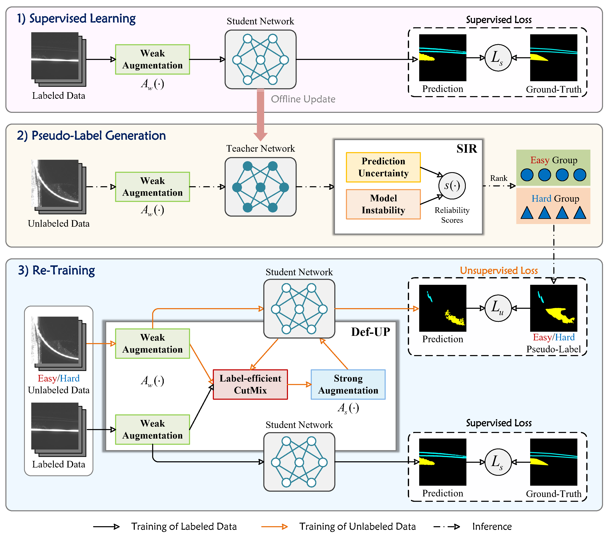

# **Perturbed Progressive Learning for Semisupervised Defect Segmentation [TNNLS 2023]**

This is the official PyTorch implementation of our work.

> [**Perturbed Progressive Learning for Semisupervised Defect Segmentation**](https://doi.org/10.1109/TNNLS.2023.3324188)       
> [Yao Wu](https://scholar.google.com.hk/citations?user=QYbmS-YAAAAJ&hl=zh-CN), Mingwei Xing, Yachao Zhang, Yuan Xie, Zongze Wu, Yanyun Qu  
> *Published in: IEEE Transactions on Neural Networks and Learning Systems (TNNLS), 2023.*

## Overview


## Getting Started

### Installation

The implementation runs on
- python 3.8
- torch 1.9.0
- torchvision 0.10.0
- numpy
- pillow

### Preparation

Dataset

- MSDD-3 (soon) | [MTD](https://www.kaggle.com/datasets/alex000kim/magnetic-tile-surface-defects) | [NEU-Seg](https://github.com/DHW-Master/NEU_Seg) | [DAGM2007](https://www.kaggle.com/datasets/mhskjelvareid/dagm-2007-competition-dataset-optical-inspection)

Pre-trained Model

- [resnet18]() | [resnet50]()

### File Organization

```
├── [./dataset/splits]
    ├── MSDD-3
    ├── magnetic_tile
    ├── neu_seg
    └── DAGM
├── [./pretrained]
    ├── resnet18.pth
    └── resnet50.pth
```

## Training and Testing
Example of MTD dateset:
```
CUDA_VISIBLE_DEVICES=0 python -W ignore train.py 
    --dataset magnetic_tile 
    --data-root /path/dataset/defect/magnetic_tile 
    --backbone resnet18 
    --model deeplabv3p 
    --labeled-id-path dataset/splits/magnetic_tile/1_8/labeled.txt 
    --unlabeled-id-path dataset/splits/magnetic_tile/1_8/unlabeled.txt 
    --pseudo-mask-path outdir/pseudo_masks/magnetic_tile 
    --save-path outdir/models/magnetic_tile 
    --use_PPL 
    --reliable-id-path outdir/reliable_ids/magnetic_tile
```
```
CUDA_VISIBLE_DEVICES=0 python -W ignore eval.py 
    --dataset magnetic_tile 
    --data-root /path/dataset/defect/magnetic_tile 
    --backbone resnet18 
    --model deeplabv3p 
    --best-model-path outdir/models/magnetic_tile/best_model.pth 
    --vis_path outdir/vis_result/magnetic_tile 
    --vis_save
```

## Acknowledgements

Code is built based on [ST++](https://github.com/LiheYoung/ST-PlusPlus). Reproduced comparisons are based on [CPS](https://github.com/charlesCXK/TorchSemiSeg).

## Citation

If you find this project useful, please consider citing:
```bibtex
@article{wu2023perturbed,
  title={Perturbed Progressive Learning for Semisupervised Defect Segmentation},
  author={Wu, Yao and Xing, Mingwei and Zhang, Yachao and Xie, Yuan and Wu, Zongze and Qu, Yanyun},
  journal={IEEE Transactions on Neural Networks and Learning Systems},
  year={2023},
  publisher={IEEE}
}
```
